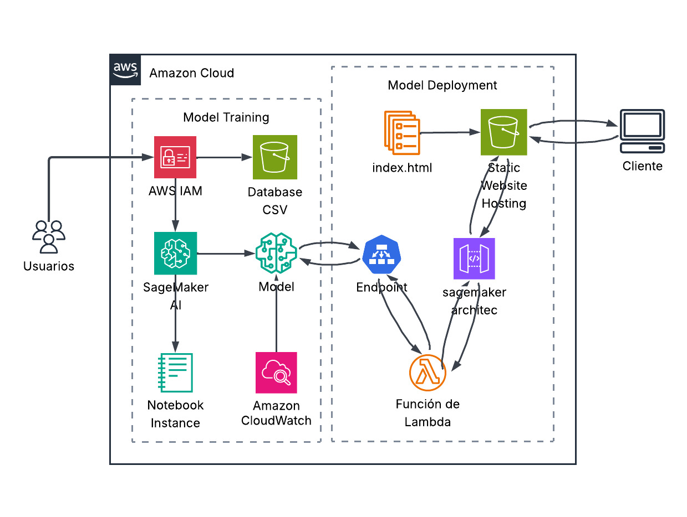
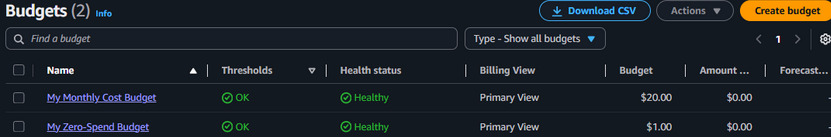
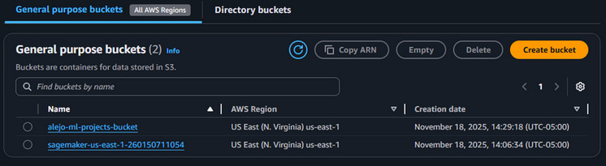
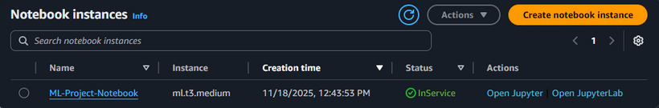
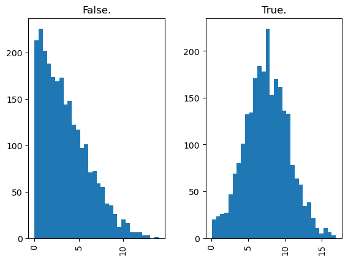
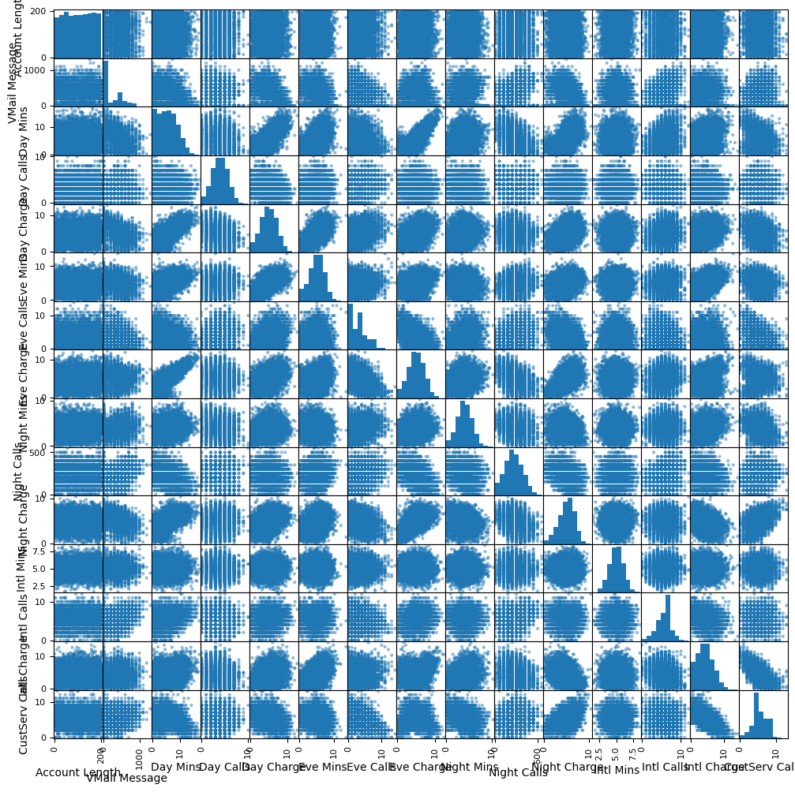
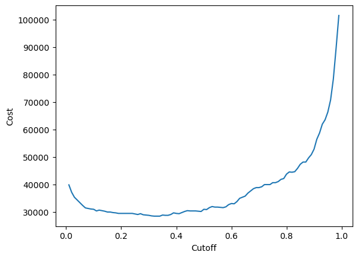
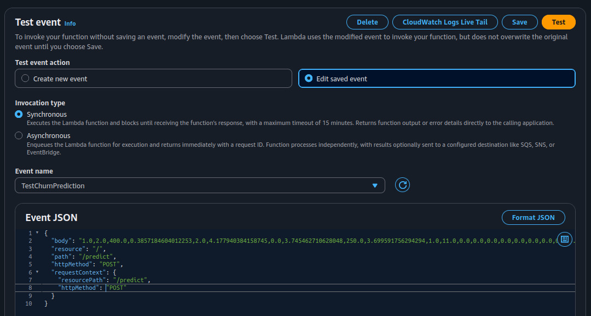
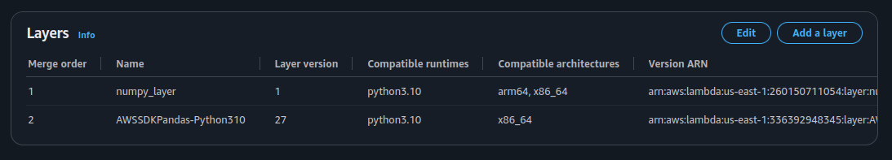
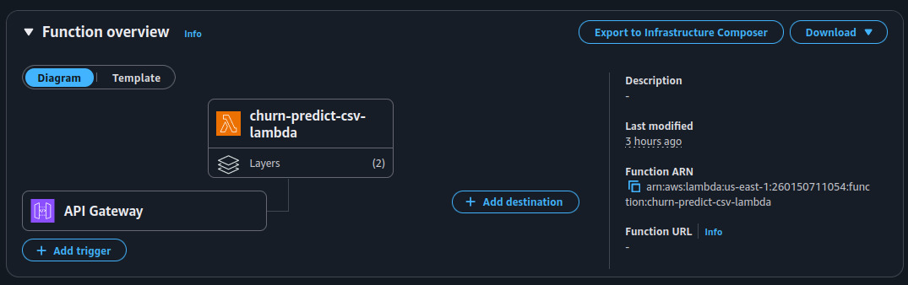

# SageMaker + XGBoost: A recommendation system for customer churn prediction

Puedes acceder a la página aquí: [**Abrir aplicación web (CSV Churn Predictor)**](http://churn-csv-frontend.s3-website-us-east-1.amazonaws.com/)

Este proyecto desarrolla un sistema completo de predicción de deserción de clientes utilizando Amazon SageMaker, Amazon S3, IAM, CloudWatch y API Gateway. Incluye análisis exploratorio de datos, selección de características, entrenamiento con XGBoost, optimización de costos mediante ajuste del umbral de clasificación y un sistema de recomendaciones basado en reglas de negocio.

---

# 1. Introducción al problema

El objetivo es predecir clientes que podrían cancelar el servicio (churn). Esto permite a la empresa aplicar estrategias de retención y reducir pérdidas económicas. El dataset contiene variables como minutos usados, cargos, llamadas al servicio al cliente, uso internacional y la variable objetivo "Churn?".

---

# 2. Tecnologías utilizadas
- Amazon SageMaker (entrenamiento y hosting del modelo)
- AWS Lambda (serverless inference)
- Amazon S3 (hosting + almacenamiento)
- API Gateway (exposición pública del modelo)
- XGBoost (modelo de machine learning)
- Pandas / NumPy / Matplotlib
- HTML + JS (frontend)

---

# 3. Arquitectura del proyecto en AWS

La solución sigue la siguiente arquitectura:

Flujo general:
### Flujo General del Sistema

1. **Gestión de Acceso:** Los usuarios acceden al sistema mediante credenciales administradas en **AWS IAM**.
2. **Almacenamiento de Datos:** Los datos originales en formato CSV se almacenan en **Amazon S3**.
3. **Preprocesamiento:** El análisis exploratorio y preprocesamiento se realizan en una instancia de **SageMaker Notebook**.
4. **Entrenamiento:** El modelo **XGBoost** se entrena en SageMaker y su ejecución se monitorea con **Amazon CloudWatch**.
5. **Despliegue:** El modelo final se guarda en S3 y se despliega como un *endpoint* en tiempo real.
6. **Frontend:** El frontend (index.html, CSS y JavaScript) se aloja en un bucket **S3** configurado como sitio web estático.
7. **Interacción:** El cliente carga un archivo CSV desde la página web servida por S3.
8. **Comunicación API:** El archivo se envía mediante una petición POST a una API HTTP configurada en **API Gateway**.
9. **Backend (Serverless):** API Gateway invoca la función **AWS Lambda** a través de una integración proxy.
10. **Inferencia:** La función Lambda procesa el CSV, extrae las *features* y llama al endpoint de SageMaker para obtener las predicciones.
11. **Lógica de Negocio:** Lambda construye el reporte con los clientes en riesgo y sus recomendaciones basadas en reglas de negocio.
12. **Visualización:** Lambda devuelve un JSON al frontend, donde se organiza y muestra visualmente el resultado al usuario.

---

# 4. Gestión de usuarios y seguridad (IAM)

Para trabajar con AWS se configuró lo siguiente:

- Se usó el usuario root solo para configuración inicial.  
- Se crearon usuarios IAM con permisos mínimos necesarios.  
- Se asignaron roles para SageMaker mediante get_execution_role.  
- Se evitó que usuarios estándar tengan acceso administrativo.

---

# 5. Control de costos con AWS Budgets

Se configuró un presupuesto para evitar gastos inesperados:

El presupuesto envía alertas por correo cuando se supera un umbral definido.

---

# 6. Buckets S3 usados en el proyecto

Los datos y modelos se manejaron desde el bucket:

alejo-ml-projects-bucket

Se almacenaron:
- Datos originales.  
- Datos procesados.  
- Datos de entrenamiento y validación.  
- Artifacts del modelo.  
- Archivos generados por el notebook.

---

# 7. Instancia de Notebook SageMaker

Se usó una instancia ml.t3.medium para desarrollar todo el proyecto:

---

# 8. Exploración y descripción del dataset

El dataset contiene información sobre uso del servicio telefónico y comportamiento del usuario. Las variables principales incluyen:

- Day Mins, Eve Mins, Night Mins  
- Day Calls, Eve Calls, Night Calls  
- Intl Mins, Intl Calls  
- Customer service calls  
- Intl Plan  
- Voice Mail Plan  
- Variable objetivo: Churn?

---

# 9. Análisis exploratorio: histogramas y análisis visual

Se generaron histogramas para observar las distribuciones:

Conclusiones:
- Varias variables presentan distribuciones aproximadamente gaussianas.  
- Los clientes que más usan minutos diarios presentan mayor tendencia a desertar.  
- El número de llamadas al servicio al cliente es un indicador importante de insatisfacción.

---

# 10. Eliminación de variables irrelevantes

Se eliminaron las variables:
- State  
- Area Code  

Estas no aportaban información predictiva significativa. También se eliminaron los cargos (Day Charge, Eve Charge, Night Charge, Intl Charge) debido a alta correlación con los minutos correspondientes.

---

# 11. Tablas de frecuencia

Se analizaron frecuencias categóricas según el valor de "Churn?". Esto permitió identificar variables con patrones diferenciados entre usuarios que desertan y los que no.

---

# 12. Distribuciones comparadas entre Churn y No Churn

Se compararon histogramas para cada variable segmentada por la variable objetivo.

Por ejemplo, en "Day Mins":

Conclusión: los clientes con más minutos diarios presentan un riesgo mayor de deserción.

---

# 13. Matriz de correlación y gráfico de pares

Conclusiones:
- Las variables de cargos y sus respectivos minutos están altamente correlacionadas.  
- Las variables redundantes fueron eliminadas para evitar multicolinealidad.  

---

# 14. División de datos

Se usó:
- 70% para entrenamiento  
- 20% para validación  
- 10% para prueba  

Se usó random_state=1729 para garantizar reproducibilidad.

Los datos de entrenamiento y validación se subieron a Amazon S3 para ser usados por SageMaker.

---

# 15. Entrenamiento del modelo XGBoost en SageMaker

SageMaker permite entrenar usando el contenedor oficial de XGBoost:

xgboost 1.7-1

La instancia usada fue:

ml.m4.xlarge

Los hiperparámetros definidos fueron:

max_depth=5
eta=0.2
gamma=4
min_child_weight=6
subsample=0.8
objective="binary:logistic"
num_round=100

Significado de los hiperparámetros:

- max_depth: profundidades máximas de los árboles. Evita sobreajuste.  
- eta: velocidad de aprendizaje. Valores bajos dan estabilidad.  
- gamma: ganancia mínima para dividir un nodo. Ayuda a evitar divisiones irrelevantes.  
- min_child_weight: tamaño mínimo de una hoja. Evita dividir en grupos demasiado pequeños.  
- subsample: fracción de datos usada por cada árbol. Introduce aleatoriedad que mejora la generalización.  
- objective: define una clasificación binaria con salida logística.  
- num_round: número total de árboles.

---

# 16. Despliegue del endpoint

El modelo se desplegó como un endpoint en tiempo real. Esto permite recibir datos tabulares en formato CSV y obtener probabilidades de churn mediante una API REST.

---

# 17. Evaluación del modelo

Una vez generado el endpoint, se evaluó el conjunto de datos de prueba:

- Se obtuvieron probabilidades de churn para cada cliente.
- Se generaron matrices de confusión.
- Se evaluó la capacidad del modelo para separar las dos clases.

---

# 18. Métricas de desempeño antes de optimizar el umbral

Antes de realizar la optimización del umbral para minimizar costos, se calcularon métricas fundamentales de desempeño del modelo sobre el conjunto de prueba. Estas métricas permiten entender qué tan bien se comporta el modelo al clasificar correctamente clientes que harán churn y clientes que no lo harán.

Las métricas obtenidas fueron:

- Sensitivity o Recall (TPR = TP / (TP + FN)) = 0.9919  
  Esta métrica mide la capacidad del modelo para detectar correctamente a los clientes que realmente hacen churn. Un valor cercano a 1 indica que casi todos los clientes que desertan están siendo identificados. En el contexto del negocio, esto es importante porque perder clientes que no fueron detectados (falsos negativos) genera pérdidas económicas mayores.

- Specificity (TNR = TN / (TN + FP)) = 0.8735  
  Indica qué tan bien el modelo identifica correctamente a los clientes que NO harán churn. Un valor alto significa que el modelo rara vez etiqueta como "en riesgo" a clientes que realmente no piensan desertar.

- Precision (TP / (TP + FP)) = 0.8845  
  Representa la proporción de predicciones positivas correctas. Es decir, cuando el modelo indica que un cliente va a hacer churn, Precision indica la probabilidad de que esto sea cierto. Es útil para evaluar el costo por falso positivo (contactar a un cliente innecesariamente).

- Accuracy ((TP + TN) / Total) = 0.9320  
  Es el porcentaje total de clasificaciones correctas. Aunque es una métrica global, no debe ser la única evaluada cuando existe un costo diferente entre falsos negativos y falsos positivos, como en este caso.

- F1-score = 0.9351  
  Es la media armónica entre Precision y Recall. Resume el equilibrio entre detectar churn (Recall) y no sobredimensionar el número de falsos positivos (Precision). Es especialmente útil en problemas donde la clase positiva tiene un impacto económico relevante.

Estas métricas muestran que el modelo tiene un desempeño sólido: identifica correctamente la gran mayoría de clientes que harán churn y mantiene un nivel aceptable de precisión al predecir clientes en riesgo. Sin embargo, en problemas de deserción el objetivo principal no es maximizar la precisión global, sino minimizar las pérdidas económicas. Por esta razón, después de evaluar estas métricas, se procedió con la optimización del umbral de decisión para reducir el costo total asociado a falsos positivos y falsos negativos.

# 19. Optimización del umbral de decisión para minimizar costos

Esta es la parte más importante del proyecto.

El modelo produce probabilidades, pero el negocio necesita decidir a partir de qué probabilidad se considera que un cliente está en riesgo.

Costos asumidos:
- Pérdida por un falso negativo: 500 dólares.  
- Costo por un falso positivo (intervenir sin necesidad): 100 dólares.  

Para cada umbral entre 0.01 y 1 se calculó:

Costo_total = 500 * FN + 100 * FP

Se generó esta gráfica:

Conclusión principal:
El umbral óptimo que minimiza el costo total es 0.32.  
Este umbral genera el equilibrio ideal entre intervenir clientes que lo requieren y no gastar demasiado en clientes que no desertan.

---

# 20. Sistema de recomendaciones (Next Best Action)

Se agregó un sistema de reglas de negocio que sugiere la mejor acción de retención para cada cliente con probabilidad mayor a 0.32.

Ejemplos:
- Si el cliente tiene más de 3 llamadas al servicio: asignar agente personal.  
- Si el cliente tiene alto gasto: descuento del 25%.  
- Si tiene uso internacional alto: bono internacional.  
- Si usa muchos minutos al día: oferta de actualización de equipo.  
- Otros casos: incentivo general.

Este sistema permite convertir la predicción en acciones útiles para la empresa.

---

# 21. Pruebas y Configuración de la Función Lambda

# Testeo inicial de la función Lambda

Para verificar el correcto funcionamiento de la función Lambda antes de integrarla con el sitio web y la API Gateway, se creó un evento de prueba dentro del panel de AWS Lambda. Esto permitió enviar manualmente un conjunto de datos simulados a la función para comprobar que el cuerpo del CSV era recibido correctamente, que podía ser leído por Pandas y que el flujo interno llegaba hasta la llamada al endpoint de SageMaker. Este proceso permitió detectar errores iniciales sin necesidad de ejecutar toda la arquitectura.

Durante estas pruebas se descubrió que la función Lambda no incluye por defecto librerías como NumPy o Pandas, lo cual generaba errores al intentar importarlas.

# Uso de Layers para agregar dependencias

Para que la función Lambda pudiera ejecutar correctamente NumPy y Pandas fue necesario incorporar Layers. Se agregaron dos capas: una capa personalizada llamada numpy_layer y una capa proporcionada por AWS para Pandas. La capa de NumPy debió ser creada manualmente como un archivo .zip compatible con Python 3.10. La estructura interna del archivo debe seguir la jerarquía exigida por AWS, donde dentro del .zip debe existir primero una carpeta llamada python y dentro de esta una carpeta llamada lib que contenga el contenido de la librería. De lo contrario, la función Lambda no es capaz de identificar los módulos y se generan errores de importación.

# Conexión entre Lambda y el endpoint de SageMaker

La función Lambda actúa como puente entre la página web y el modelo entrenado en SageMaker. El código realiza una llamada usando boto3 hacia el endpoint de SageMaker especificado en la variable ENDPOINT_NAME. El endpoint utilizado en este proyecto se llama churn-xgboost-prod-v1, el cual contiene el modelo previamente entrenado bajo el nombre sagemaker-xgboost-2025-12-01-02-55-03-387. La función Lambda recibe el CSV, extrae las features, las envía al endpoint y recupera la probabilidad de churn generada por el modelo.

# Trigger de la función Lambda mediante API Gateway

La función Lambda no corre de manera continua, únicamente se ejecuta cuando es invocada. En este proyecto la invocación proviene de una API HTTP configurada en API Gateway. Esta API funciona como la entrada pública al sistema y recibe las solicitudes POST enviadas desde el sitio web alojado en S3. La ruta configurada es POST /analyze-csv y está definida como una integración proxy, lo que significa que todo el cuerpo de la solicitud se pasa directamente a Lambda. API Gateway también gestiona las reglas CORS necesarias para permitir la comunicación entre el frontend alojado en S3 y la función Lambda sin restricciones de navegador.

# Hosting del frontend en un bucket S3

El bucket S3 llamado churn-csv-frontend contiene la página web del proyecto, incluyendo el archivo index.html, las hojas de estilo CSS y el código JavaScript. El JavaScript del frontend permite cargar el archivo CSV, leerlo en el navegador, enviarlo mediante POST a la API Gateway y procesar la respuesta JSON generada por Lambda. El resultado se transforma en un reporte visual con los clientes en riesgo y sus recomendaciones respectivas.

Para habilitar el bucket como un sitio web se activó la opción de Static Website Hosting dentro de las configuraciones de S3, definiendo el archivo index.html como documento principal. Además, el bucket requiere una política pública que permita a cualquier usuario leer los archivos, ya que sin estos permisos el sitio web no puede ser accedido desde un navegador. La política incluida habilita privilegios únicamente de lectura y mantiene el bucket protegido para cualquier otra operación.

# Función Lambda utilizada en el proyecto

La función Lambda implementa la lógica necesaria para leer el archivo CSV, decodificarlo en caso de que llegue en Base64, generar un DataFrame con las columnas esperadas, enviar las features al endpoint de SageMaker, obtener las predicciones, identificar los clientes cuyo riesgo supera el umbral TARGET_CHURN_PROBABILITY_CUTOFF y aplicar un motor de recomendación basado en las reglas del negocio. Finalmente se construye una estructura JSON que contiene la información resumida de los clientes de riesgo, incluyendo la fila original del CSV, las variables relevantes, la probabilidad de churn y la recomendación correspondiente. Este JSON es devuelto al frontend para construir el reporte visual.

# 22. Conclusiones generales

- SageMaker permitió entrenar y desplegar un modelo profesional de churn.

- La ingeniería de características mejoró notablemente los resultados.

- La eliminación de variables redundantes redujo multicolinealidad.

- XGBoost demostró ser adecuado para este tipo de datos tabulares.

- La optimización del umbral (0.32) fue crucial para minimizar costos.

- El sistema de recomendaciones agrega valor práctico y accionable.

- La integración con AWS Lambda permitió ejecutar inferencias sin servidores, procesar archivos CSV en tiempo real y aplicar el motor de recomendaciones directamente en la nube.

- API Gateway proporcionó una interfaz HTTP moderna y segura que sirvió como punto de entrada para consumir el modelo desde aplicaciones externas.

- El frontend alojado en S3 facilitó una interacción sencilla para el usuario, permitiendo cargar archivos CSV y recibir resultados inmediatos de churn y recomendaciones.

- La arquitectura final combinó S3, API Gateway, Lambda y SageMaker para crear un sistema robusto, escalable y de bajo costo, cumpliendo con los principios esenciales de MLOps.

---

# Autores

Miller Alejandro Arboleda Garcia, 
Edwin Ricardo Leguizamón Ballén, 
Proyecto de Machine Learning con AWS SageMaker,
Universidad Nacional de Colombia sede Medellín
